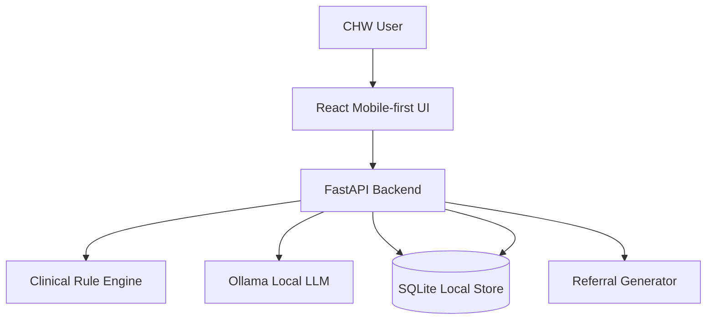

# SANA — Symbiotic AI for Neonatal & Maternal Assistance

**An offline-first, multimodal AI co-pilot for community health workers.**

## Problem Statement
Every day, hundreds of women die from preventable pregnancy and childbirth complications. Many of these deaths happen in low- and middle-income regions where Community Health Workers (CHWs) are the only trained point of contact. CHWs need instant risk assessment, clinical decision support, visual screening support, and referral capabilities—all without relying on consistent internet connectivity.

## Solution Summary
SANA transforms a low-cost or mid-range Android phone into a private, offline clinical decision-support tool. It empowers CHWs with AI-driven risk assessment using local, offline language models to interpret symptoms and vitals.

## Key Features
- **Offline-First Architecture**: Runs completely local, no internet required.
- **Risk Assessment**: Rule-based and LLM-assisted clinical risk scoring.
- **Multimodal Potential**: Built to accommodate image-based observations (with future integration for vision models).
- **Referral Generation**: Instantly generates referral letters for high-risk patients.
- **Local Storage**: Secure, on-device visit logging using SQLite.

## Architecture



## Tech Stack
- **Backend**: Python, FastAPI, Pydantic, SQLite, Ollama
- **Frontend**: React, Vite, Tailwind CSS

## Setup Instructions

### Backend
1. Open a terminal and navigate to the backend directory:
   ```bash
   cd backend
   ```
2. Create a virtual environment (optional but recommended):
   ```bash
   python -m venv venv
   source venv/bin/activate
   ```
3. Install dependencies:
   ```bash
   pip install -r requirements.txt
   ```
4. Start the server:
   ```bash
   uvicorn app.main:app --reload
   ```

### Frontend
1. Open another terminal and navigate to the frontend directory:
   ```bash
   cd frontend
   ```
2. Install dependencies:
   ```bash
   npm install
   ```
3. Start the Vite dev server:
   ```bash
   npm run dev
   ```

### Ollama Setup
1. Download and install [Ollama](https://ollama.com/).
2. Pull the required model (e.g., a Gemma model):
   ```bash
   ollama run gemma:2b
   ```
3. Ensure the Ollama service is running in the background.

## Environment Variables
Create a `.env` file in the `backend/` directory with the following variables:
```env
OLLAMA_URL=http://localhost:11434
MODEL_NAME=gemma:2b
DATABASE_URL=sqlite:///./sana.db
```

## Demo Workflow
1. Open the application in your browser.
2. Click "Start Assessment".
3. Enter patient details: 32 weeks pregnant, complaints of headache and swelling, BP 150/100, blurred vision.
4. Click "Assess Risk".
5. The system will categorize this as HIGH or EMERGENCY risk.
6. A referral letter will be generated, and the visit logged.
7. Click "Save Visit" to complete the flow.

## API Endpoints
- `GET /` - Health check.
- `POST /assess` - Submit patient data for risk assessment.
- `POST /visits` - Save a patient visit record.
- `GET /visits` - Retrieve all saved visits.
- `POST /referral` - Generate a referral letter.
- `POST /image-assess` - Assess visual clinical signs (placeholder).

## Clinical Safety Disclaimer
**SANA is a hackathon prototype for educational and demonstration purposes only. It is not a certified medical device and does not provide diagnosis or treatment. Always consult qualified healthcare professionals and follow local emergency protocols.**

## Future Roadmap
- Integration with Gemma multimodal vision models.
- Fine-tuning on WHO maternal health protocols.
- Whisper.cpp local speech-to-text integration.
- Local text-to-speech support.
- Encrypted patient storage.
- Synchronization to district health systems.
- Android APK wrapper.

## GitHub Push Instructions
To push this project to GitHub, run:
```bash
git init
git add .
git commit -m "Initial commit: SANA offline maternal health AI prototype"
git branch -M main
git remote add origin <MY_GITHUB_REPO_URL>
git push -u origin main
```
