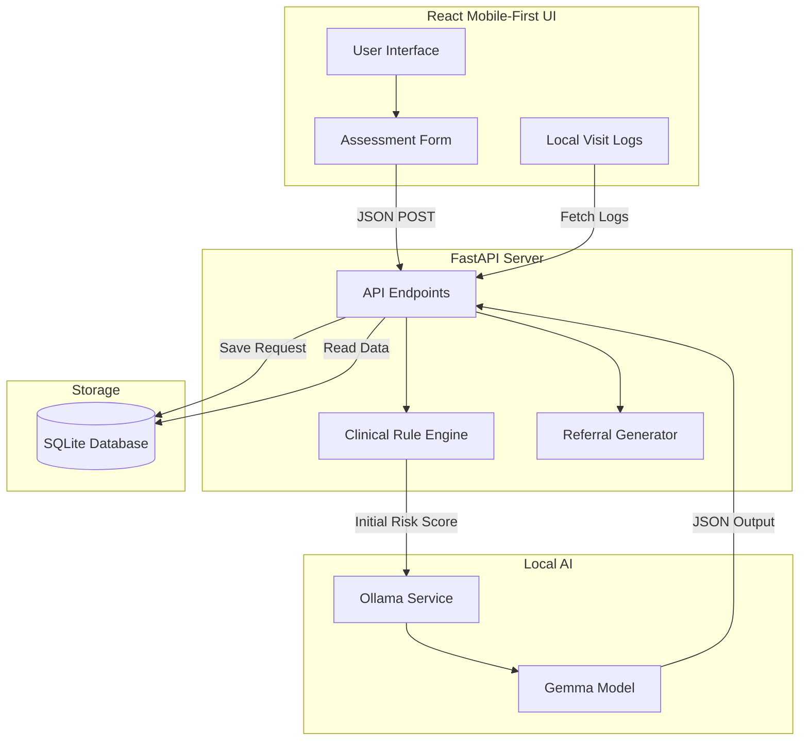

# SANA Architecture

The SANA prototype is built with a local-first, offline-capable architecture designed to run on a CHW's local device (or a local clinic server).

## Overview

## Components

1. **Frontend**: A React application built with Vite and Tailwind CSS. It communicates with the backend via REST APIs.
2. **Backend**: A Python FastAPI application that provides endpoints for assessment and data storage.
3. **Clinical Rule Engine**: Python functions that calculate risk levels based on clinical guidelines (e.g., blood pressure thresholds, danger signs).
4. **Local AI**: The backend communicates with a local Ollama instance running a small language model (like Gemma 2B). This model enriches the rule-based output with a clinical summary and reasoning.
5. **Storage**: SQLite database for local, offline visit logging.
